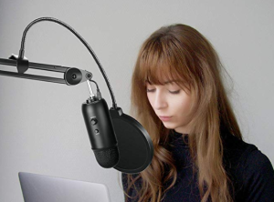
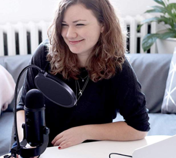

# work-from-home-setup

So, here is my current list of things I would recommend for people for working from home for meetings. It is a combination of Headphones, Mic, Lighting, and Camera.

Ideally we are going for something like this:

 or 

## Microphone:
Good audio is important!
### All in one 
Advantage... all in one, USB, nothing else needed, but more limiting.

* Blue Yeti Nano - $100 - https://amzn.to/395En9c
* Blue Yeti - $130 - https://amzn.to/2woFSlp
* With either of these I highly recommend that they have a place where it can be really close to them or an Arm Mount is great and some of these have combos

### Headset 
If you don't have a desk or prefer a headset just literally any headset that is like $20 will work

### Stand alone Mics
* MXL 770 - $70 - https://amzn.to/2QAfLyV
* Top Pick - Blue Blackout SL - $200 - https://amzn.to/2x9obGH

#### These also need an audio interface
* U-Phoria UMC22 - $70 - https://amzn.to/2IZMWHZ
* Also need XLR cable
* Amazon Basics - < $10 - https://amzn.to/2x99dAu

### Microphone Arm Mount - Recommended
* Cheap - NEEWER Arm - $14 - https://amzn.to/2Qum1bi
* Top Pick - Blue Compass - $100 - https://amzn.to/3947j11
* Top Pick - Rode PSA 1 (preferred) - $100 - https://amzn.to/33wFL3t

### Pop Filter
Everyone needs a pop filter and they are all the same (good for both all in one and standalone mics)
* Simple - Neewer $10 - https://amzn.to/2JfA2Wx
* Nicer - Blue - $50 https://amzn.to/2U73GmU

## Headphones:
I like a nice monitoring studio headset. They usually are made for longer sessions and nice and comfy.
* Entry - Samson SR850 - $50 - https://amzn.to/2xgNu9u
* Preferred - Sony MDR7506 - $90 - https://amzn.to/3dgW4Wy

## Webcams:
Everything is basically sold out or at crazy prices. I usually recommend the Logitech C920 as it is basic and under $40 and does a great job, but everything is crazy expensive. I would then recommend capturing a DSLR or go-pro(like i do) with a Cam Link, but they are also completely sold out.

## Lighting:
I am a huge fan of the keylight. they are expensive, but really nice with awesome control of power and temp
* Full Key Light - $180 - https://amzn.to/2J3VTQE
* Key Light Air - $130 - https://amzn.to/3dl8VHo

You can also get a series of Ring Lights that Hanselman has recommended in the past before, but I think they make your eyes look weird unless you get a large one coming from the top down.

## Desk
I love a good sit/stand desk and personally own a [Fully](https://www.fully.com/)

## Live Streaming?
Looking to live stream on Twitch/YouTube/Mixer? Checkout my [Gist on my setup](https://gist.github.com/jamesmontemagno/72f513bff91678b2c0130a4427f21f0d)

## Podcasting?
Looking to podcast? I have a guide similar to this on my blog: https://montemagno.com/podcast-equipment-accessories-guide/

__Any amazon link is an affiliate link <3__
